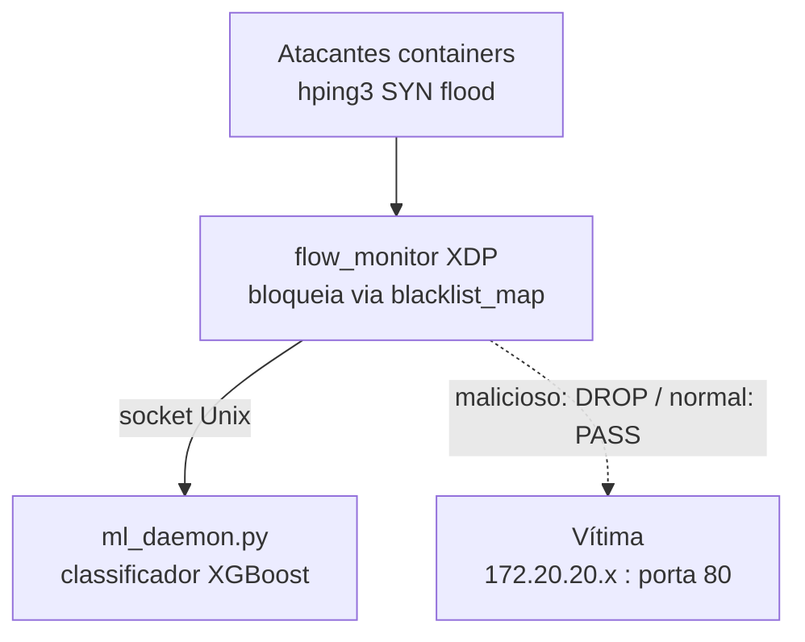

# xdp-flow-monitor

Monitor de rede com XDP/eBPF e detecção de DDoS por machine learning (XGBoost).

## Visão geral

O sistema captura pacotes em tempo real via XDP no kernel Linux, agrega métricas em janelas de 5 segundos e consulta um daemon Python com modelo XGBoost para classificar fluxos como ataque ou tráfego normal. IPs classificados como ataque são adicionados a uma blacklist no kernel e descartados imediatamente.

## Requisitos

- Linux com kernel 5.10+ (testado no Ubuntu 22.04 em VirtualBox)
- Permissão root para carregar programas BPF e usar XDP
- Docker (para simular o ambiente de ataque)
- Disco com ao menos 1 GB livre

## Dependências do sistema

```bash
sudo apt update
sudo apt install -y \
  clang llvm \
  libbpf-dev \
  linux-headers-$(uname -r) \
  libelf-dev \
  zlib1g-dev \
  python3 python3-pip \
  linux-tools-common \
  linux-tools-$(uname -r) \
  gcc-multilib
```

> Se `linux-tools-$(uname -r)` não estiver disponível, use `linux-tools-generic`.

## Dependências Python

```bash
pip3 install scikit-learn numpy scipy xgboost pandas
```

## Estrutura de arquivos relevantes

```
xdp-flow-monitor-main/
├── flow_monitor.bpf.c   # Programa eBPF (kernel)
├── main.c               # Userspace: lê ring buffer, chama ML, atualiza blacklist
├── window.c / window.h  # Janela de agregação de métricas
├── common.h             # Structs compartilhadas kernel/userspace
├── ml_daemon.py         # Daemon de classificação XGBoost
├── train_model.py       # Treina o modelo com dataset CSV
dataset/
└── Syn.csv              # Dataset CIC-DDoS2019 (arquivo 01-12/Syn.csv)
```
## Diagrama da Topologia



## Passo 1 — Gerar o dataset e treinar o modelo

A partir da raiz do repositório (pasta `xdp-flow-monitor`):

```bash
mkdir -p dataset
python3 - <<'EOF'
import pandas as pd
import numpy as np

np.random.seed(42)
n = 5000

normal = pd.DataFrame({
    "Flow Duration": np.random.randint(1000000, 10000000, n),
    "Flow Packets/s": np.random.uniform(1, 1000, n),
    "Flow Bytes/s": np.random.uniform(100, 100000, n),
    "ACK Flag Count": np.random.randint(0, 10, n),
    "SYN Flag Count": np.random.randint(0, 3, n),
    "RST Flag Count": np.random.randint(0, 1, n),
    "URG Flag Count": np.zeros(n, dtype=int),
    "CWR Flag Count": np.zeros(n, dtype=int),
    "Packet Length Mean": np.random.uniform(100, 1400, n),
    "Min Packet Length": np.random.randint(40, 200, n),
    "Label": "BENIGN"
})

attack = pd.DataFrame({
    "Flow Duration": np.random.randint(1000, 5000000, n),
    "Flow Packets/s": np.random.uniform(100000, 500000000, n),
    "Flow Bytes/s": np.random.uniform(5000000, 25000000000, n),
    "ACK Flag Count": np.random.randint(0, 2, n),
    "SYN Flag Count": np.random.randint(100000, 2000000000, n),
    "RST Flag Count": np.random.randint(0, 5, n),
    "URG Flag Count": np.zeros(n, dtype=int),
    "CWR Flag Count": np.zeros(n, dtype=int),
    "Packet Length Mean": np.random.uniform(40, 60, n),
    "Min Packet Length": np.random.randint(40, 60, n),
    "Label": "DDoS"
})

df = pd.concat([normal, attack], ignore_index=True).sample(frac=1, random_state=42)
df.to_csv("dataset/synthetic_ddos.csv", index=False)
print(f"Dataset gerado: {len(df)} linhas")
EOF

python3 train_model.py
cp ddos_model.ubj xdp-flow-monitor-main/
```

## Passo 2 — Compilar o projeto

Dentro de `xdp-flow-monitor-main/`:

```bash
cd xdp-flow-monitor-main

# Compilar o programa BPF (requer sudo)
sudo clang -O2 -g -target bpf \
  -I/usr/include/$(uname -m)-linux-gnu \
  -c flow_monitor.bpf.c \
  -o flow_monitor.bpf.o

# Gerar o skeleton
bpftool gen skeleton flow_monitor.bpf.o > flow_monitor.skel.h

# Compilar o userspace
gcc -O2 -o flow_monitor main.c window.c -lbpf -lelf -lz

# Dar permissão de execução
chmod +x flow_monitor
```

## Passo 3 — Descobrir a interface de rede correta

A interface veth dos containers muda a cada reinício da VM. Os IPs dos containers também mudam a cada reinício — sempre redescubra ambos antes de rodar.

```bash
# Descobre a veth do atacante1 (interface onde o monitor deve ser anexado)
IFLINK=$(docker exec clab-xdp-ddos-atacante1 cat /sys/class/net/eth0/iflink)
IFACE=$(ip link show | grep "^${IFLINK}:" | awk -F': ' '{print $2}' | cut -d'@' -f1)
echo "Interface atacante1: $IFACE"

# Descobre o IP atual da vítima (alvo do ataque)
docker exec clab-xdp-ddos-vitima ip addr show eth0 | grep "inet "

# Descobre os IPs atuais de todos os atacantes
for i in 1 2 3 4; do
  IP=$(docker exec clab-xdp-ddos-atacante$i ip addr show eth0 | grep "inet " | awk '{print $2}' | cut -d'/' -f1)
  echo "atacante$i -> $IP"
done
```

> **Importante:** O monitor deve ser anexado na **veth do atacante** (não da vítima). O XDP captura pacotes no modo ingress — na veth do atacante isso corresponde ao tráfego SYN saindo em direção à vítima. Na veth da vítima, o que seria capturado é o tráfego RST/ACK de retorno, o que causaria o `src` reportado ser sempre o IP da vítima em vez do atacante.

## Execução — 3 terminais necessários

> **Importante:** Os containers Docker precisam estar rodando antes de iniciar os testes. Verifique com `docker ps`. Se a VM foi desligada sem salvar o estado, os containers podem ter parado — nesse caso será necessário recriá-los.
>
> **Recomendação:** Sempre use "Salvar estado da máquina" no VirtualBox ao encerrar, em vez de desligar. Assim os containers continuam ativos quando você retornar.

### Ao retornar após salvar o estado da VM

Confirme que os containers ainda estão ativos:

```bash
docker ps
```

Se estiverem listados, siga direto para os terminais abaixo. Se não estiverem, será necessário recriar o ambiente de containers antes de continuar.

### Terminal 1 — ML daemon

```bash
cd ~/xdp-flow-monitor/xdp-flow-monitor-main
python3 ml_daemon.py
```

Saída esperada:
```
[OK] Modelo carregado: ddos_model.ubj
[OK] Escutando em /tmp/ml_engine.sock
```

> Mantenha este terminal aberto e rodando durante todo o teste. Se for interrompido com Ctrl+C, o monitor não conseguirá classificar os fluxos.

### Terminal 2 — Monitor XDP

```bash
cd ~/xdp-flow-monitor/xdp-flow-monitor-main

# Descubra a interface correta (rode toda vez que reiniciar a VM)
IFLINK=$(docker exec clab-xdp-ddos-atacante1 cat /sys/class/net/eth0/iflink)
IFACE=$(ip link show | grep "^${IFLINK}:" | awk -F': ' '{print $2}' | cut -d'@' -f1)
echo "Interface: $IFACE"

sudo ./flow_monitor $IFACE
```

Ou manualmente, substituindo `<interface>` pela veth encontrada:

```bash
sudo ./flow_monitor <interface>
```

### Terminal 3 — Atacante (simulação DDoS)

```bash
# Descubra o IP atual da vítima antes de atacar
docker exec clab-xdp-ddos-vitima ip addr show eth0 | grep "inet "

# Substitua <IP_VITIMA> pelo IP encontrado acima
docker exec clab-xdp-ddos-atacante1 hping3 --flood --syn -p 80 --keep -s 12345 <IP_VITIMA>
```

Para atacar com múltiplos containers em background (descubra o IP da vítima primeiro):

```bash
docker exec -d clab-xdp-ddos-atacante2 hping3 --flood --syn -p 80 --keep -s 12345 <IP_VITIMA>
docker exec -d clab-xdp-ddos-atacante3 hping3 --flood --syn -p 80 --keep -s 12345 <IP_VITIMA>
docker exec -d clab-xdp-ddos-atacante4 hping3 --flood --syn -p 80 --keep -s 12345 <IP_VITIMA>
```

### Terminal 4 — Vítima (opcional, para verificar conectividade)

```bash
docker exec -it clab-xdp-ddos-vitima bash
```

## Saída esperada

No terminal do monitor, após a janela de 5 segundos fechar:

```
====================================================
Janela fechada — src: 172.20.20.6
Flow Packets/s   : 289571782.00
Flow Bytes/s     : 15636876228.19
Packet Len Mean  : 54.00 bytes
Min Packet Len   : 54 bytes
TCP Flags        : SYN:1451012464 ACK:0 RST:0 URG:0 CWR:0
[ATAQUE DETECTADO] Bloqueando IP...
====================================================
```

> O `src` exibido é o IP do **atacante**, não da vítima. O IP exato varia a cada reinício dos containers.

No terminal do ML daemon:

```
[ATAQUE] src_ip=101979308 pkts/s=289571782.0
```

## Observações

- O modelo foi treinado com o dataset real **CIC-DDoS2019** (`Syn.csv`), atingindo 100% de acurácia. O dataset contém tráfego real de SYN flood capturado em laboratório pelo grupo CIC da Universidade de New Brunswick.
- O `blacklist_map` bloqueia IPs via XDP com `XDP_DROP`, antes mesmo do pacote chegar ao kernel, tornando o bloqueio extremamente eficiente.
- A janela de agregação é configurável em `window.h` via `WINDOW_SEC` (padrão: 5 segundos).
- O monitor deve ser anexado na veth do **atacante**, não da vítima. Na veth da vítima, o XDP captura apenas o tráfego de retorno (RST/ACK), fazendo o `src` reportado ser sempre o IP da vítima.
- O `flow_monitor.bpf.c` filtra por `dst_port=80`, ignorando pacotes de retorno (RST/ACK) cujo `src_port=80`. Isso garante que apenas o tráfego de ataque (SYN com destino à porta 80) seja monitorado.
- A interface veth e os IPs dos containers mudam a cada reinício — sempre redescubra ambos antes de rodar o monitor e o ataque.
- A compilação do programa BPF requer `sudo` (`sudo clang ...`).
